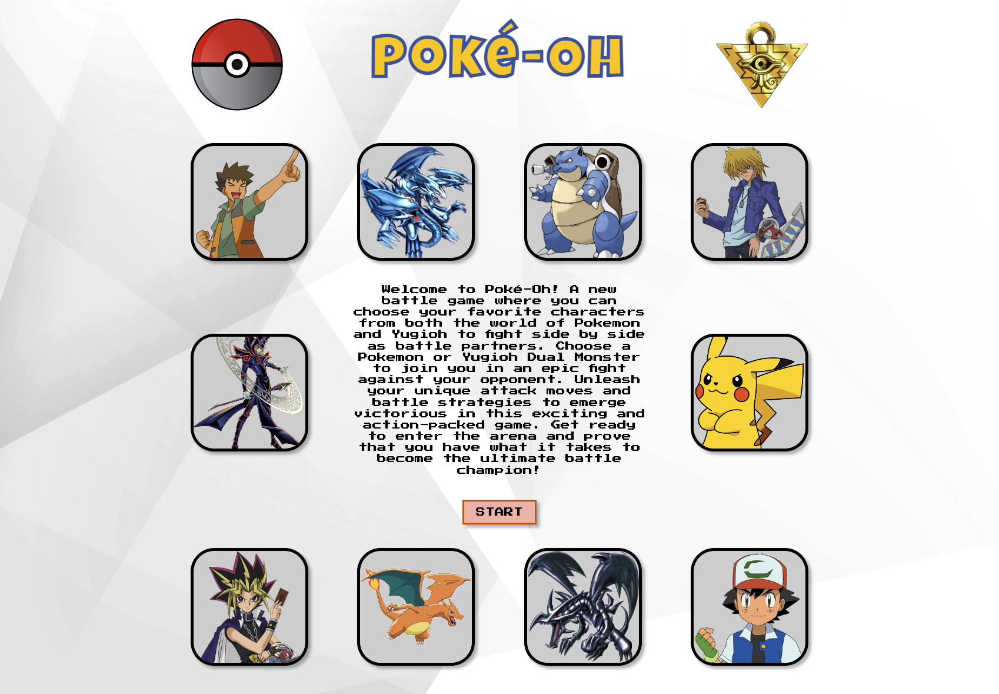
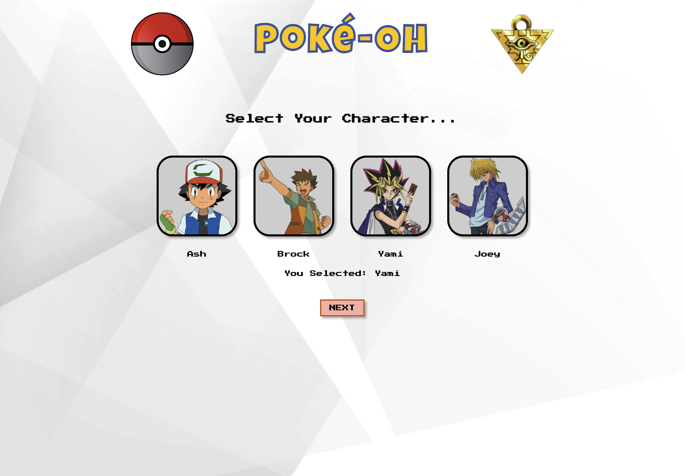
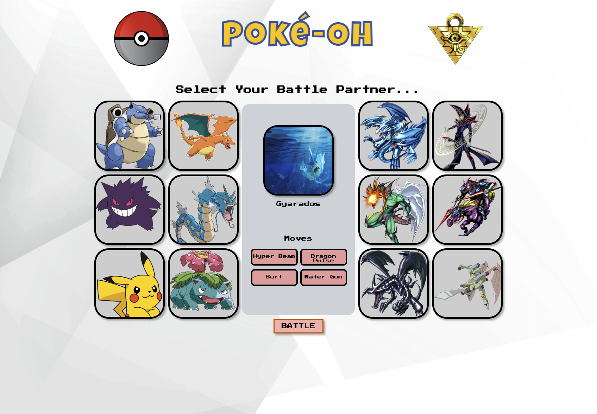
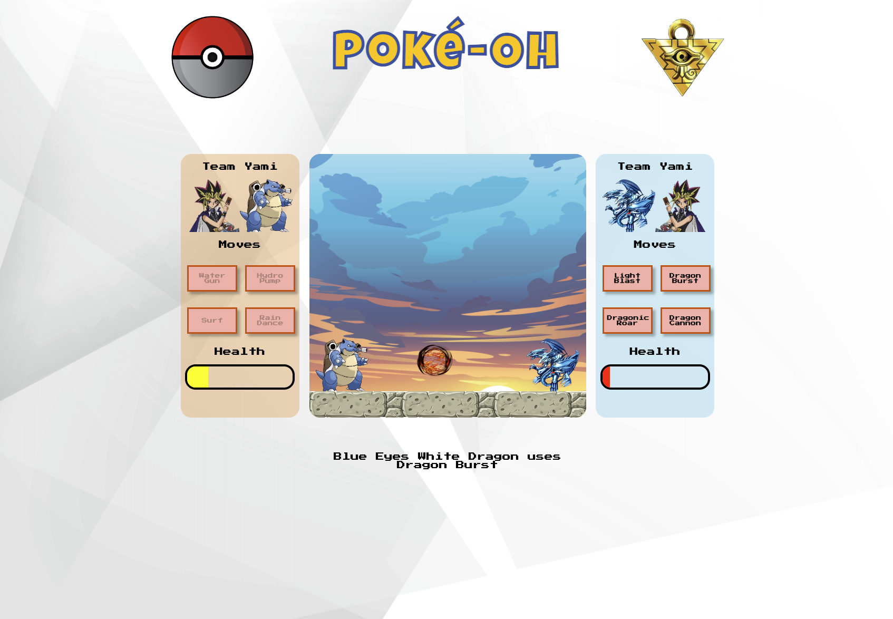
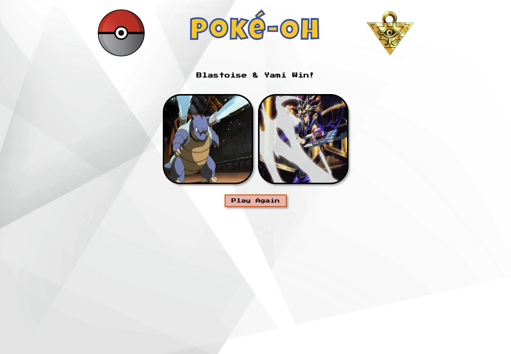

# pokeoh-project1
"Poké-Oh" is an exciting game where players select their favorite characters and battle against each other using unique moves and animations. This repository contains all the code for the game, including the HTML, CSS, and JavaScript files. With intuitive user interface design, it is easy to navigate through the game. 

[Link To Play Game](https://fxhanloniii.github.io/pokeoh-project1/)

- Home Page:
Brief Description of game,
Start Button
- Character Page:
You Select A Character,
Next Button
- Select Your Battle Partner: 6 Pokemon & 6 Duel Monsters, You can only select one to battle with!
- Battle Begins 
    - Player 1 Goes First Choosing 1 Attack.
    - The attack executes & gets a random damage multiplier.
    - Opponent/Computer goes randomly choosing attack
    - This process repeats until one teams health is 0

# Process
    - Sketching out basic layout of pages and assets
    - Wireframing
    - Visual Continuity
    - Sourcing Assets
    - Adobe Illustrator: Edit aset images to transparent background
    - HTML & CSS
    - Connecting the pages
    - Javascript
    - CSS Touch Up

# Screenshots

# Sources
    - Resources
        - https://developer.mozilla.org/en-US/docs/Web/CSS/CSS_Animations
        - https://www.w3schools.com/css/css3_animations.asp
        - https://css-tricks.com/
        - https://developer.mozilla.org/en-US/docs/Web/JavaScript/Reference/Global_Objects/Object/keys
        - https://www.w3schools.com/html/html5_audio.asp
        - https://developer.mozilla.org/en-US/docs/Web/Media/Autoplay_guide
    - Blue Eyes White Dragon
        - https://www.deviantart.com/xrosm/art/Blue-Eyes-Ultimate-Dragon-Full-Artwork-768877332
    - Pokeball    
        - https://stock.adobe.com/images/pokeball-icon-vector-isolated-on-white-background/115815669?asset_id=115815669
    - Millennium Puzzle
        - https://www.deviantart.com/alanmac95/art/Millennium-Puzzle-Render-649219089
    - Dark Magician
        - https://www.deviantart.com/matteste/art/Dark-Magician-Alt-YuGiOh-Master-Duel-949102223
    - Red Eyes Black Dragon
        - https://www.pngitem.com/middle/iRiJbox_dragon-png-by-carlos123321-yu-gi-oh-kort/
    - Gaia The Fierce Knight
        - https://yugipedia.com/wiki/Gaia_The_Fierce_Knight_%28archetype%29 
    - Elemental Hero Flame Wingman
        - https://www.deviantart.com/rmrlr2020/art/Elemental-HERO-Flame-Wingman-899739835 
    - Charizard
        - https://images.secretlab.co/theme/common/collab_pokemon_catalog_charizard-min.png
    - Gengar
        - https://www.nicepng.com/png/full/158-1582287_by-racamo-on-deviantart-pokemon-gengar-vector.png
    - Pikachu
        - https://www.pngplay.com/wp-content/uploads/11/Pikachu-Pokemon-Transparent-PNG.png
    - Gyarados
        - https://archives.bulbagarden.net/media/upload/b/bc/0130Gyarados.png
    - Blastoise   
        - https://flyclipart.com/download-png#google_vignette
    - Valkirion
        - https://www.google.com/search?q=valkirion+yugioh+transparent+background&tbm=isch&ved=2ahUKEwj6rK6Q6Jj9AhUiOUQIHVawAKYQ2-cCegQIABAA&oq=valkirion+yugioh+transparent+background&gs_lcp=CgNpbWcQAzoECCMQJ1DzCljhFWCRVWgAcAB4AIABRYgBzgSSAQIxMJgBAKABAaoBC2d3cy13aXotaW1nwAEB&sclient=img&ei=knztY_qbA6LykPIP1uCCsAo&bih=1202&biw=1313#imgrc=am6OdVXyRAr04M
    - Venusaur
        - https://www.google.com/search?sxsrf=AJOqlzVDeMi445_fsMJkCfEEH-CNWpisdw:1676566807096&q=venusaur+transparent+background&tbm=isch&source=univ&fir=0sjj3nSQGjxeuM%252C4ATJu-IELWXn3M%252C_%253BLQihHhHzjS8RyM%252CIdp0SH2c7BvFFM%252C_%253Bi9FtYbCgDP9b7M%252CCPVdFNaDqJYq9M%252C_%253BltlDy7WKZXME6M%252CR8MNufet0iBu9M%252C_%253B7JkjyMrkzY_JOM%252CXhf05l07mY1vRM%252C_%253Bo4b3yd8H4c1rhM%252C060YX7156s6dRM%252C_%253B-wELeOeZAvoUGM%252CugVhLHNB9W9cBM%252C_&usg=AI4_-kRrUZR_3YyKQiP_Po4y1CaYLf6mQA&sa=X&ved=2ahUKEwiPreqHwpr9AhUOiO4BHSCHD6sQ7Al6BAgFEE4&biw=1570&bih=1202&dpr=1#imgrc=VZ-k8IraIvVYQM
    - Background
        - https://stock.adobe.com/search?filters%5Bcontent_type%3Aphoto%5D=1&filters%5Bcontent_type%3Aillustration%5D=1&filters%5Bcontent_type%3Azip_vector%5D=1&filters%5Bcontent_type%3Avideo%5D=1&filters%5Bcontent_type%3Atemplate%5D=1&filters%5Bcontent_type%3A3d%5D=1&filters%5Bcontent_type%3Aimage%5D=1&filters%5Borientation%5D=horizontal&k=digital+background&order=relevance&safe_search=1&limit=100&search_page=1&search_type=usertyped&acp=&aco=digital+background&color=%23EBEBEB&get_facets=1&asset_id=338389344
    - Battle Background
        - https://stock.adobe.com/search?filters%5Bcontent_type%3Aphoto%5D=1&filters%5Bcontent_type%3Aillustration%5D=1&filters%5Bcontent_type%3Azip_vector%5D=1&filters%5Bcontent_type%3Avideo%5D=1&filters%5Bcontent_type%3Atemplate%5D=1&filters%5Bcontent_type%3A3d%5D=1&filters%5Bcontent_type%3Aimage%5D=1&filters%5Borientation%5D=horizontal&filters%5Borientation_type%5D%5Bis_horizontal%5D=true&k=anime+background&order=relevance&safe_search=1&limit=100&search_page=1&search_type=usertyped&acp=&aco=anime+background&get_facets=1&asset_id=308242904
    - Ground
        - https://stock.adobe.com/search?filters%5Bcontent_type%3Aphoto%5D=1&filters%5Bcontent_type%3Aillustration%5D=1&filters%5Bcontent_type%3Azip_vector%5D=1&filters%5Bcontent_type%3Avideo%5D=1&filters%5Bcontent_type%3Atemplate%5D=1&filters%5Bcontent_type%3A3d%5D=1&filters%5Bcontent_type%3Aimage%5D=1&filters%5Borientation%5D=horizontal&filters%5Borientation_type%5D%5Bis_horizontal%5D=true&k=video+game+floor+tile&order=relevance&safe_search=1&limit=100&search_page=1&search_type=remove-breadcrumb&acp=&aco=video+game+floor+tile&get_facets=1&asset_id=381478877
    - Attack Images
        - https://opengameart.org/content/fire-explode
        - https://opengameart.org/content/water-magic-effect
        - https://opengameart.org/content/magic-effects
    - Game Audio
        - https://opengameart.org/content/let-the-battles-begin
        - https://opengameart.org/content/on-my-way-8-bit-loop